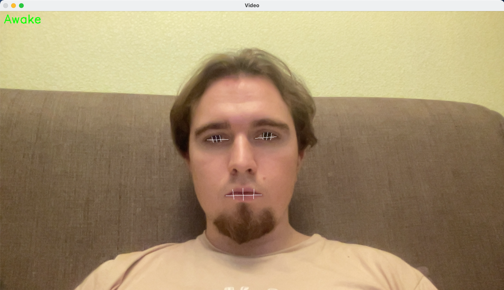
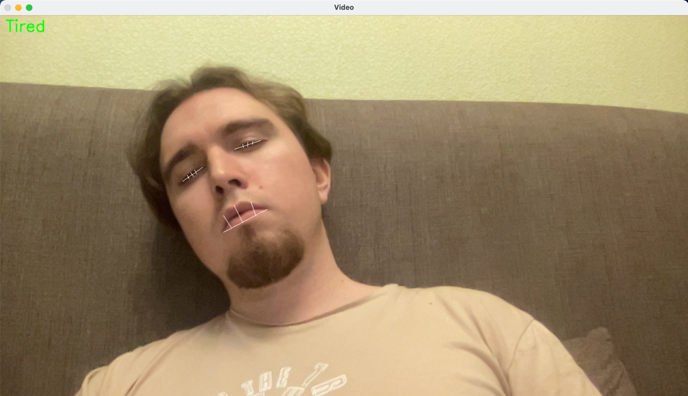

# Оценка усталости по видео

Реализовано 2 модели для оценки: CNN и XGBoost.

Входные данные:
* CNN - кадр 224x224
* XGBoost - признаки выделенные из изображения (площадь/соотношение сторон глаза, рта и круглость глаза) 

Примеры работы программы (XGBoost):

